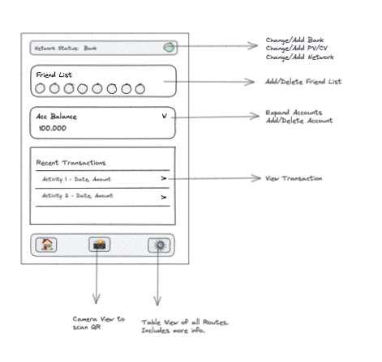

# tnbc mobile wallet - typescript alpha template

This is a thenewboston SDK integration sample template with react native.

There are some minor getting started issues with the mobile wallet (as of 03-September-2021) which blocks development.

**Note:** This repo is a work in progress. (proof-of-concept)

### App Features:



### Milestones:

View docs milestones for specific features that are done + changelog
```
/docs
  /milestones
    01.md
```

## Getting Started

Yarn
```
yarn install
yarn start
```


### iOS (requires mac os x and XCode)

**NOTE**: You'll need to setup your apple developer / development team for ios to run.
This [SO thread](https://stackoverflow.com/questions/39524148/xcode-error-code-signing-is-required-for-product-type-application-in-sdk-ios#:~:text=Select%20a%20development%20team%20in%20the%20project%20editor.&text=You%20need%20to%20go%20to%20the%20General%20tab%20and%20select%20a%20Team) will get you started on adding that credential in Xcode

Alternatively if already know your cert id, you can place it in within `xcodeproj`.
`DEVELOPMENT_TEAM = "";`

```
npx pod-install
yarn start
yarn ios --simulator="iPhone 12"
```

### Android (requires Android Studio)

To Build Android
```
yarn android
```

To Android (mac)
```
yarn android-clean
```

## Using this template to make it your own

```
git clone git@github.com:wakawakathedev/tnbc_mobile_template.git
cd tnbc_mobile_template
npx react-native-rename "<YOUR_PROJECT_NAME>"
```


### Other helpful notes.
I've included the npm command `yarn android-clean` but this currently would only work on mac.
You can use `npx react-native-clean-project` to do a clean setup.

### License
MIT

### Author
wakawakathedev